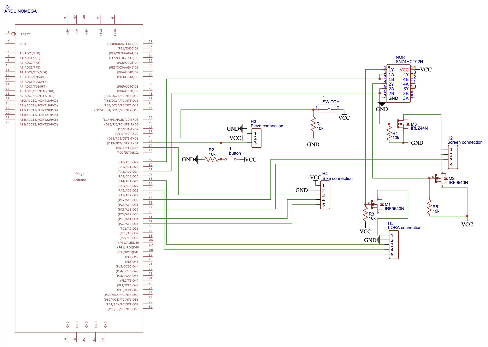
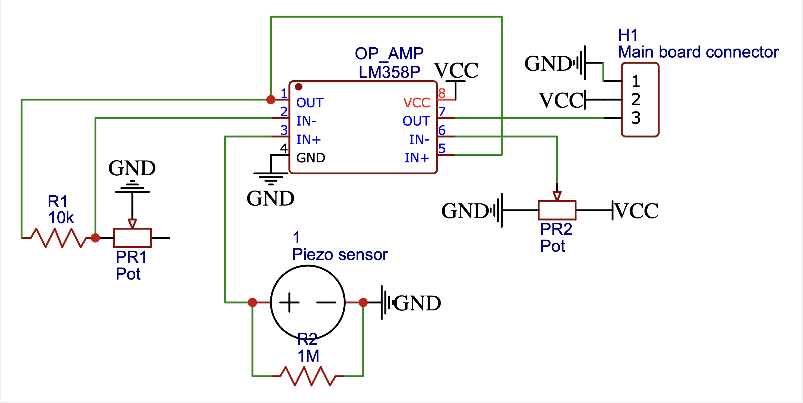

# SMART BIKE
Smart Bike is a multi-module device designed to protect your motorcycle from theft attempts and enhance your riding experience. When the bike is off, its movement sensor detects unauthorized actions and sends instant Telegram alerts to the owner. When the bike is on, Smart Bike offers a clean dashboard displaying the speed and integrated indicator monitoring.


## Anti-thef module
This module operates under the control of the Arduino Mega and is activated when the motorcycle is turned off. It utilizes a movement detector, consisting of a piezoelectric sensor, which is connected to the microcontroller. When any movement is detected, it triggers an interrupt signal, causing both the board and the LORA module to wake up and initiate the transmission of an alert message.
The LORA module sends a signal to the receiver, which is then forwarded to the ESP chip connected to the internet through WiFi. The ESP, utilizing a Telegram bot, promptly sends the alarm message to all subscribed users.


## Smart Dashboard module
When the motorbike is turned on, the LCD screen is powered displaying the real-time velocity. This instantaneous feedback is made possible by a magnetic sensor fixed near the wheel, precisely measuring its revolution time. Through a circular buffer, these readings are stored, allowing us to calculate the velocity using a moving average of the last three values, taking the wheel diameter into account. Furthermore, the LCD screen presents the blinking indicators whenever they are activated.


## Finite State Machine


At startup, the microcontroller checks the key state and initializes the FSM in the appropriate state: SCREEN_ON_INIT when the bike is on, WAIT_TO_GO_SLEEP_INIT otherwise.
- SCREEN_ON_INIT: turns the sreen on, detaches the piezo-pin interrupt, attaches the wheel-speed sensor interrupt, and initializes the circular buffer.
- SCREEN_ON: in this state, the main board sends data to the screen every 1.1 seconds.
- WAIT_TO_GO_TO_SLEEP_INIT: detaches the wheel-speed sensor interrupt and attaches the piezo-pin interrupt.
- WAIT_TO_GO_TO_SLEEP: here we wait 10 seconds before setting the alarm and put the microcontroller to sleep.
- SLEEP: Arduino is in sleep mode and waits for the interrupt from the piezoelectric module.
- WAIT_TO_SEND_ALARM: turns the LORA module on and sends an alarm after three seconds.
- WAIT_TO_TUNR_LORA_OFF: waits one second and turns LORA module off.


## Requirements

### Main hardware requirements
- Arduino Mega 2560
- ESP32
- 2 LORA E220 Modules
- Piezoelectric sensor
- TFT LCD Display 3.5''
- Arduino Uno

### Software requiremets - Arduino libraries
- [EByte LoRa E220 library](https://github.com/xreef/EByte_LoRa_E220_Series_Library)
- [ArduinoJson](https://github.com/bblanchon/ArduinoJson)
- [MCUFRIEND_kbv](https://github.com/prenticedavid/MCUFRIEND_kbv)
- [UniversalTelegramBot](https://github.com/witnessmenow/Universal-Arduino-Telegram-Bot)


## Project structure
```
├── BikeSimulator
│   └── BikeSimulator.ino        # script to run the bike simulator (for Arduino)
├── LORA-TelegramBridge
│   └── LORA-TelegramBridge.ino  # script to use Telegram bot (for ESP32)
├── LORAConfiguration
│   └── LORAConfiguration.ino    # script to configure LoRa modules
├── MainBoard
│   └── MainBoard.ino            # script to manage the movement sensor, the bike sensors and the LCD
└── Screen
    └── Screen.ino               # script to display the image on the LCD screen
```

## Getting started
In order to get the project running, you need to download the code and install the libraries.
Configure both LORA modules with LORAConfiguration sketch, load the Screen sketch on the Arduino Uno, the MainBoard sketch on the Arduino Mega and finally the LORA-TelegramBridge sketch on the ESP.
To connect the ESP device to the internet, you need to change in the "Receiver.ino" file the "ssid" and "password" variables according to your network.
To be able to receive the alert messages, you need to search for the Telegram bot "@iotAntiTheftBot" and run the command "/start". This procedure will save your chat ID and burn it inside the EEPROM memory of the ESP. In this way, even if the device is turned off or disconnected from the power supply, the information will not be lost.
You then need a 5V signal from the motorbike to understand if it is on or off, for example from the key switch, and the 5V signals for the two indicators. You also need to mount a sensor for the wheel for the spinning readings and insert your real wheel diameter inside the main in the "wheelDiameter" variable.


## Details of implementation
The voltage generated by the piezoelectric sensor is too low to generate an interrupt. For this reason, we created a board to amplify the signal and compare it with a threshold to produce a 5V digital signal. Both the amplifier gain and the threshold can be set using the two potentiometers.
We decided to use an Arduino Mega as main board since we need three interrupt signals to run the project: one for the sensor of the wheel, one for the key of the bike, and one for the piezoelectric sensor.
We put the LCD on a different microcontroller (another Arduino Uno) that exchanges JSON messages with the main board through UART protocol. The JSON message contains informations about the velocity and the state of the indicators.
If you don't have a full bike to use or you just want to try the project, we created a bike simulator. It consists of a switch that mimics the key status, two buttons for the two indicators, and a square wave generator, to simulate the wheel spinning. We used an Arduino Uno and a potentiometer to create the wave signal.
The main board connected to Arduino Mega communicates with the LORA module and sends it a "1" to be transmitted to raise the alarm. It reads also the digital signal coming from the piezoelectric module and the three signals produced by the motorbike.
On the main board we have three MOSFET to manage the power supply to LORA module and LCD screen only when needed.


## Schematics of main components

### Main board


### Piezoelectric sensor


## DEMO
[video]()
[presentation]()
